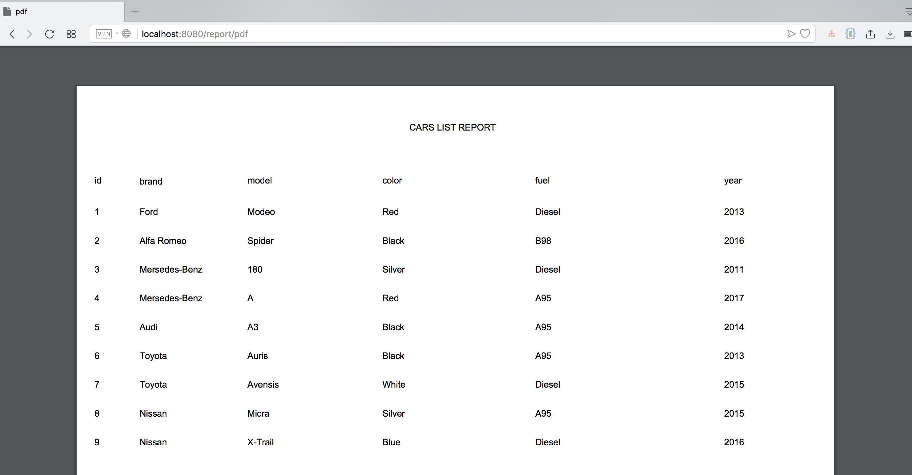
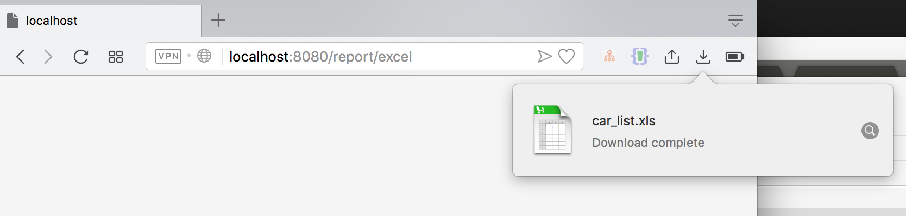

# Spring Boot MySQL Report

Run this project by this command :

`mvn clean spring-boot:run`

Go to :
* http://localhost:8080
* http://localhost:8080/report/pdf --> To get PDF Report
* http://localhost:8080/report/excel2 --> To Get XLS Report

#### Screenshot

PDF Report

XLS Report

